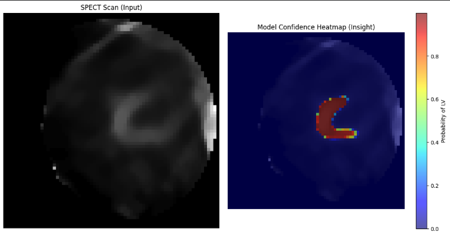
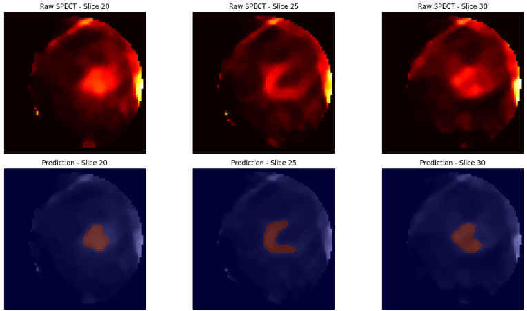

# ☢️ SPECT-LV-Segmenter: Myocardial Perfusion Analysis


<p align="center">
  
  <br>
  <em>Figure 1: Automated Left Ventricle segmentation with Uncertainty Heatmaps. (Left: Raw SPECT, Middle: Prediction, Right: Probability Map)</em>
</p>

<p align="center">
  
  <br>
  <em>Figure 2: Automated Left Ventricle segmentation. (Top: Raw SPECT, Bottom: Prediction)</em>
</p>

**Automated segmentation of the left ventricular wall from Myocardial Perfusion SPECT images using nnU-Net.**
Built for clinical reproducibility, interpretability, and robust performance on the PhysioNet MPS Dataset.

## 📋 Table of Contents
- **The Mission**
- **Model**
- **Dataset & Preprocessing**
- **Repository Structure**
- **Installation (Docker)**
- **🚀 Option 1: Train from Scratch**
- **🧠 Option 2: Pretrained Inference**
- **Visualization & Insights**
- **Credits**


## 🏥 The Mission
Cardiovascular diseases remain a leading cause of mortality globally. **Myocardial Perfusion SPECT (Single-Photon Emission Computed Tomography)** is a critical imaging modality for assessing blood flow to the heart muscle (left ventricle).

This repository provides an end-to-end pipeline to:

1. **Standardize Data**: Convert raw clinical DICOM data into NIfTI formats suitable for deep learning.
2. **Segment**: Automatically identify the Left Ventricle (LV) using nnU-Net, the state-of-the-art self-configuring framework for medical segmentation.
3. **Explain**: Provide interpretable outputs (Probability Heatmaps) to aid clinicians in trusting the model ("The Insights").

## 🧠 Model

**We use nnU-Net V2 with a 2D configuration.**

Key features:
- Automatic architecture configuration
- Dice + Cross Entropy loss
- 5-fold cross validation (usually nnUnet performs 5 folds but due to GPU limitations we decided to do only  0 fold with 200 epochs)
- Patch-based training

**Our pretrained model scores:**
- Epoch: 228

- Train loss: -0.9747

- Validation loss: -0.8556

- Pseudo Dice: 0.8973

**Google Colab links:**

[Preprocessing and Training](https://colab.research.google.com/drive/1ty-v1-J_mvrP1T8izCo8D74vuBtZ6NvH?usp=sharing)

[Continuing training, predictions and visualizations](https://colab.research.google.com/drive/1b_lrf7zDM0ENmZ3tt4ZkgZJuAINna_8p?usp=sharing)

## 📦 Dataset & Preprocessing
Source: [PhysioNet Myocardial Perfusion SPECT (MPS) Database](https://www.google.com/url?sa=E&q=https%3A%2F%2Fphysionet.org%2Fcontent%2Fmyocardial-perfusion-spect%2F1.0.0%2F)


The dataset consists of 83 unique patients acquired using a CZT-based gamma camera (Discovery NM 530c, GE Healthcare). The dataset contains two key components:
• Raw SPECT scans in DICOM format
• Expert-annotated segmentation masks in NIfTI format 

(There are more images than patients cause some patients have more than one image)

### Data Split Strategy
To ensure strict evaluation, the data is split based on the availability of ground-truth masks:

- **Training/Validation**: 100 images (Paired with expert-annotated masks).
- **Testing/Inference**: Images without provided masks (Used to demonstrate model generalization on unseen data).
  
### The Pipeline (prepare_dataset.py)

We implemented a robust preprocessing script that:

1. Downloads the raw data automatically.
2. Pairs DICOM inputs with NIfTI masks.
3. Resamples geometry to fix resolution mismatches.
4. Formats the directory structure strictly for nnU-Net (Dataset ID: 999).
     
## 🛠 Installation (Docker)
To guarantee reproducibility, we use Docker. This ensures you run the exact same environment (CUDA 11.7, PyTorch 2.0, nnU-Net V2) as used during development.

**1. Create the data directories on your host machine:**

```bash
cd ~
mkdir -p nnUNet_data/nnUNet_raw
mkdir -p nnUNet_data/nnUNet_preprocessed
mkdir -p nnUNet_data/nnUNet_results
```

Ensure your local folder looks like this before starting:

nnUNet_data   

  ├── nnUNet_raw
    
  ├── nnUNet_preprocessed
    
  └── nnUNet_results

2. Clone the repository
   
```bash
  git clone https://github.com/Jeevanesh18/IDSC_SPECT.git
  cd IDSC_SPECT
   ```

4. Build the Docker image. It may take a while especially longer if you are using mac (5-10mins):
```bash
  docker build -t spect-segmenter .
   ```
5. Run the container:
**Note: We mount the local folders to the container so data persists after the container stops.**

a)If your host machine has GPUs
```bash
  docker run --gpus all -it \
  -v ~/nnUNet_data/nnUNet_raw:/app/nnUNet_raw \
  -v ~/nnUNet_data/nnUNet_preprocessed:/app/nnUNet_preprocessed \
  -v ~/nnUNet_data/nnUNet_results:/app/nnUNet_results \
  -v ~/nnUNet_data:/data \
  spect-segmenter
   ```
b)If your host machine has **no** GPUs
```bash
  docker run -it \
  -v ~/nnUNet_data/nnUNet_raw:/app/nnUNet_raw \
  -v ~/nnUNet_data/nnUNet_preprocessed:/app/nnUNet_preprocessed \
  -v ~/nnUNet_data/nnUNet_results:/app/nnUNet_results \
  -v ~/nnUNet_data:/data \
  spect-segmenter
   ```

You are now inside the container terminal.
## 🚀 Option 1: Train from Scratch (You need GPUs)
Follow these steps to reproduce the training pipeline completely.
**1. Download and Preprocess Data:**
This script downloads the zip from PhysioNet, converts DICOMs, and splits the data.
```bash
  python prepare_dataset.py
   ```
**2. Train the Model:**
We use a 2D nnU-Net configuration. This script verifies integrity and trains Fold 0.
```bash
  bash preprocess_train.sh
   ```
## 🧠 Option 2: Use Pretrained Model
If you do not have the time or GPU resources to train, you can use my pretrained weights.

**1. Download Weights:**

Download the nnUNet_data folder from [Google Drive Link Here](https://drive.google.com/drive/folders/1DU7dGl11zWsVBxHRrTs__HaPOLE4SSkd?usp=sharing).

**2. Setup:**

Unzip the content and place the contents of nnUNet_raw,nnUNet_preprocessed,nnUNet_results into your local nnUNet_data existing folder.

**3. Run Inference:**

Start the Docker container (as shown in Installation). Run the prediction script to generate segmentation masks for the test set.
```bash
  bash predict.sh
   ```
**Reminder: I predicted using the best checkpoint path after 200 epoch**

## 🔍 Visualization & Insights
Medical AI must be explainable. We generate detailed PDF reports for every patient in the test set.
**Generate Reports:**
```bash
  python visualization.py
   ```
Output:
Check nnUNet_results/Dataset999_SPECT/visualizations. Each PDF contains:
1. **Raw SPECT**: The original input slice.
2. **Segmentation**: The predicted LV wall.
3. **Uncertainty Heatmap**: A probability map showing the model's confidence levels.
   
Example Output:
A heatmap showing high confidence (Red) in the ventricular wall and low confidence (Blue) in the background.

## 🤝 Credits
Dataset: [PhysioNet / GE Healthcare](https://physionet.org/content/myocardial-perfusion-spect/1.0.0/).

Methodology: [nnU-Net: Self-adapting Framework for U-Net-based Medical Image Segmentation](https://github.com/MIC-DKFZ/nnUNet).

Author: [Jeevanesh18](https://github.com/Jeevanesh18).
